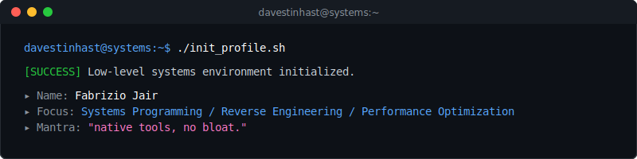

  

---

## Projects

<table width="100%">
  <tr>
    <td width="50%" valign="top">
      <h4><a href="https://github.com/davestinhast/l4d2c-anticheat-re">l4d2c-anticheat-re</a></h4>
      
Reverse engineering of l4d2c_anticheat.exe. Analysis of HWID fingerprinting, detection methods, protobuf schema, and bypass mechanics.

    </td>
    <td width="50%" valign="top">
      <h4><a href="https://github.com/davestinhast/windows-10-latency-optimizer">windows-10-latency-optimizer</a></h4>
      
Low-level latency optimization tool. Tweaks registry, services, network TCP stack, MSI mode, and CPU scheduling.

    </td>
  </tr>
  <tr>
    <td width="50%" valign="top">
      <h4><a href="https://github.com/davestinhast/keylogger">keylogger</a></h4>
      
Stealth low-level keylogger using WH_KEYBOARD_LL hooks, avoiding process injection and integrating FlushKeyBuffer API.

    </td>
    <td width="50%" valign="top">
      <h4><a href="https://github.com/davestinhast/TimerResolution">TimerResolution</a></h4>
      
System timer controller leveraging NtSetTimerResolution, memory cleaners, and gaming optimization in a single no-dependency console file.

    </td>
  </tr>
  <tr>
    <td width="50%" valign="top">
      <h4><a href="https://github.com/davestinhast/neurocity">neurocity</a></h4>
      
GPU-procedural city rendering engine written in GLSL shaders. Features dynamic window animations, rain, fog, and weather presets.

    </td>
    <td width="50%" valign="top">
      <h4><a href="https://github.com/davestinhast/seismotrack-global">seismotrack-global</a></h4>
      
Global seismic tracking system visualizing over 61k events on a 3D globe with Poisson probabilistic predictions in R + Shiny.

    </td>
  </tr>
  <tr>
    <td width="50%" valign="top">
      <h4><a href="https://github.com/davestinhast/database-guide">database-guide</a></h4>
      
Complete benchmark and reference guide for modern databases. Compares latency, enterprise pricing, and free tier allocations.

    </td>
    <td width="50%" valign="top">
      <h4><a href="https://github.com/davestinhast/cybersec-desde-cero">cybersec-desde-cero</a></h4>
      
Comprehensive 100-part cybersecurity curriculum covering networking, exploitation, Snort/iptables analysis, and forensics.

    </td>
  </tr>
</table>

### Esoteric & Language Studies
`malbolge-study` · `intercal-study` · `piet-study` · `befunge-study` · `apl-study` · `morse-study` · `whitespace-study` · `elasticidad-haskell`

---

## Languages

---

## Databases

---

## Tools & Tech

---

## Stats

  
  &nbsp;
  

---

## Activity

  

---

## Coding Habits

  
  &nbsp;
  

